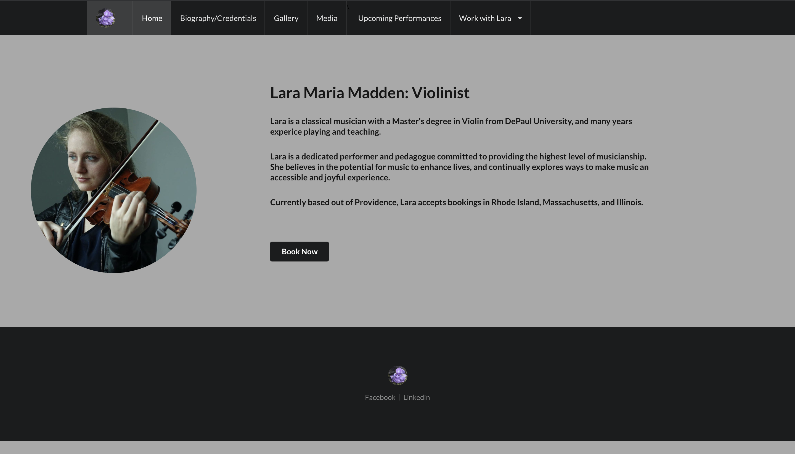

# README

## Lara's Website



### Back-end Repo: https://github.com/maddeno/larasitebackend

### Demo: https://drive.google.com/open?id=1tj2AR-t9BMg9dqSy0U-fYLffZWxYDoDB

### Front-end Features:
  - React Components
  - React-Router Navigation
  - Conditional Rendering
  - Semantic UI Styling
  - Passing data through props and state
  - Fetch

### Technologies: 
  - React 16.13.1
  - React-Router 5.1.2
  - Semantic UI-React 0.88.2
  - JWT 2.2

### Installing: 
  - Clone this repo to your local machine. ```git clone git@github.com:maddeno/larasitefrontend.git```
  - run ```npm start``` to run the server.
  - to start the full app, don't forget to install the back-end: https://github.com/maddeno/larasitebackend


This app is a professional website for my sister, Lara. She is a concert violinist / music teacher, and needed her own website as a promotional tool and for prospective clients to book gigs or lessons. Functionality is based on Lara's specifications: she wanted to provide users with all the information they would need when looking to hire a musician. Forms are available to request bookings, and contain all the relevant input fields for Lara to assess the job. 

The React front-end features components that render Lara's promotional information. The homepage is consists of a brief description of her musical philosophy and available services. A biography component gives an overview of her education and experience, and includes a more detailed resume. There is a gallery and a page of embedded videos from Lara's youtube channel so that users can hear her play. 

The most important functionality is the forms; users have access to forms for booking eithr gigs or lessons. Users are prompted to enter their contact information and the details of the job. Upon submitting a form a new instance of gig or lesson is created on the back-end, and from there Lara can review the details of the job. 

This app is intended as a first point-of-contact between Lara and her prospective clients; if further communication is ruquired after Lara receives a booking request she can handle that via the contact information entered in the form. 

Lara can also update the "status" attribute of her bookings. All gigs and lessons are instantiated with a status of "requested". She can navigate to the Bookings Handler component, which is hidden behind JWT Authentication. This component renders all gigs and lessons with a status of "requested". After logging in, Lara can update the bookings to "accepted" or "declined".

The last major component is the Upcoming Performances Calendar. This renders the time, date, and location of upcoming gigs if they meet a few conditions. Users filling out the gig form have the option to mark their event as "public". If a gig has been marked public, and it has been "accepted" by Lara, then it will appear in Performance Calendar. 